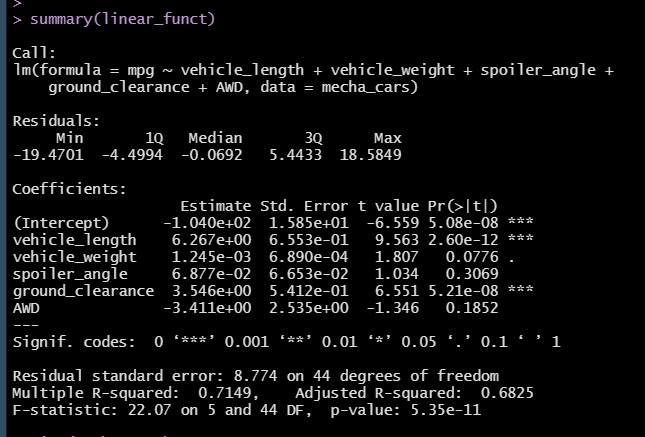

# MechaCar Statistical Analysis

## **Overview of Analysis:**
This analysis uses R to find statistical relationships between various car manufacturing factors and performance. 
  

## **Linear Regression to Predict MPG:**
 

  
The image above is the linear model summary for the data. Here we can see the results for the dataset if the dependent variable is the miles per gallon (mpg) and the independent variables are the vehicle length, vehicle weight, spoiler angle, ground clearance, and AWD. 

The data provides the following assumptions: 

1. The vehicle's length and ground clearance both have a P-value that is significantly below 0.05, which indicates there is a non-random correlation between the miles per gallon and those factors. Another potential non-random correlation could be the vehicle's weight, falling at 0.02 above the P-value's base of statistical significance. More data and analysis would be required to have as much confidence in correlation and the previous two factors. 
    
2. The slope of the linear model is not zero, as we have rejected the null hypothesis on several factors. That can also be observed the P-value, which is 5.35e-11 and below the 0.05 statistical significance standard. 
    
3. This model predicts the MechaCars prototypes effectively because of the observed R-squared value, which is observed at 0.71. This means that there is a 71% confidence that the data is effective in determining conclusions. 
  

## **Summary Statistics on Suspension Coils:**
 

Total summary of PSI examination: 
 

 

Lot summary of PSI examination: 
 

  

When examining the total summary for PSI, MechaCars meets the expectations of being below 100 PSI on average. However, when evaluating the cars by lot number, lot 3 massively exceeds the PSI requirements by more than 70, which indicates this is a variance skewing the overall average. 
MechaCars would need to do more research into what is causing the high amount of variance in the cars for lot 3, as it could be a manufacturing concern. 
  

## **T-Tests on Suspension Coils:**
 

 
According to the results above, the t-value for lot 1 equals zero, which means the overall mean for the summary and lot 1 are similar. The t-value for lot 2 is 0.51, which means that lot 2 has a small positive variance from the overall mean. The t-value for lot 3 is -2.09 with means that lot 3 has a large negative variance from the overall mean. 
MechaCars would need to be the most concerned with the variance located in lot 3. 
  

## **Study Design: MechaCar vs Competition**

MechaCars can also use statistical analysis in R to comapare their performance to their competitors. The following would need to be collected and organized in order to reach a conclusion: 

    1. The metrics of mpg(highway vs. city), user rating, safety rating, and frequency of maintenence. 
    2. A null hypothesis that there is no difference between MechaCars and their competetors. An alternative hypothesis that there is a difference, whether it be negative or positive. 
    3. Two types of statistical tests-- Multiple Linear Regression and ANOVA tests. This is because the test contains multiple variables. 
    4. The data of the metrics of both MechaCars and their competetors. 

Once this data cas been collected and analyzed in R, MechaCars can make adjustments to improve their successes against their comeptetors. 
